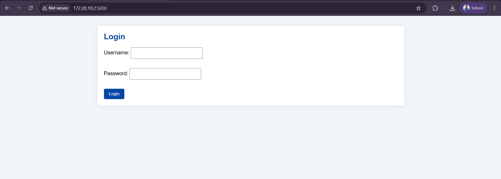
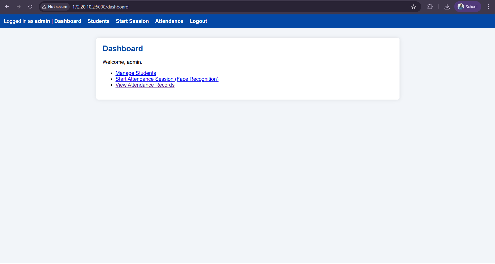
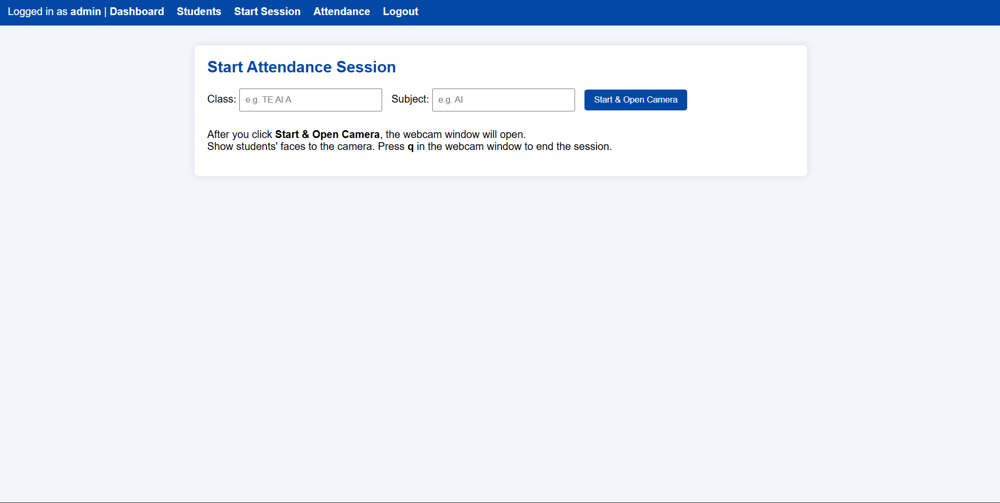
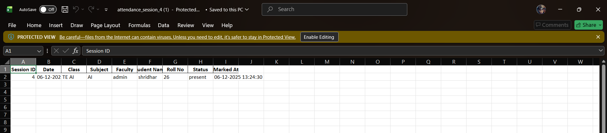

# Face Recognition Attendance System

A Flask-based attendance management system using **face recognition**.
Faculty can start an attendance session, the camera recognizes students,
marks them present, and exports the records to **Excel**.  
The app also works over **local network**, so teachers can operate it from their phone.

## Features

- Face registration for each student (using webcam or IP camera)
- Real-time face recognition to mark attendance
- Session-wise attendance storage (class, subject, faculty, date, time)
- Excel export (`.xlsx`) for each session
- Simple web UI (Flask + HTML + CSS)
- Mobile access on same Wi-Fi / hotspot

## Tech Stack

- Python, Flask
- OpenCV, `face_recognition`, dlib
- SQLite (via SQLAlchemy)
- HTML / CSS (Jinja2 templates)
- Pandas + openpyxl (for Excel export)

## Project Structure

```text
face_attendance/
├── app.py              # Flask app / routes
├── models.py           # Database models
├── face_utils.py       # Face registration & recognition logic
├── attendance.db       # SQLite database (ignored in git)
├── student_faces/      # Stored face encodings (ignored in git)
├── templates/          # HTML templates
└── static/
    └── style.css       # Basic styling

## 📸 Screenshots

### Login Page  


### Dashboard  


### Add Student Page  


### Start Attendance Session  


### Attendance Records (Excel Export)  


### Attendance Table View  

